# truco-brasa

**Truco paulista jogável na web** — 1x1, 2x2 em duplas, e treino contra bots. Servidor em
Rust. A carta trafega no WebSocket como **o próprio caractere Unicode**: `🂡 🂱 🃁 🃑`.

<p align="center">
  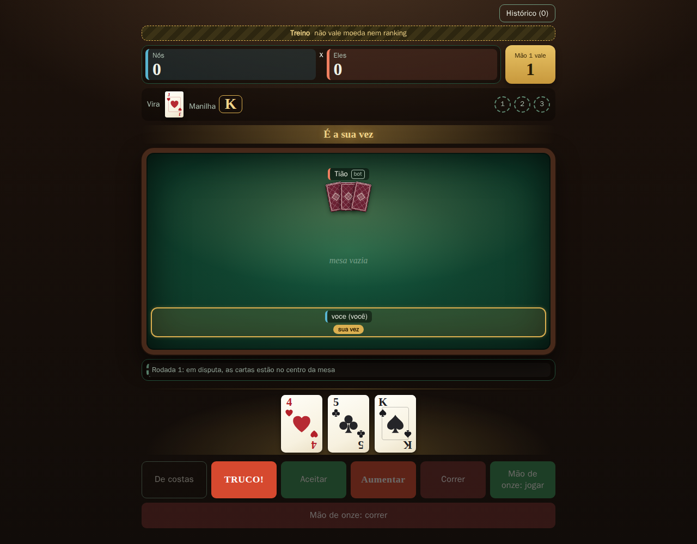
</p>

**Pesquisa, fontes e decisões:** https://github.com/yryapu/poliorketikos-truco-brasa

Cada regra de jogo implementada aqui cita a etiqueta (`R-01`…`R-31`) da especificação
normativa que vive no repositório de pesquisa, junto da fonte que a sustenta. Teste sem
etiqueta é teste de infraestrutura; regra sem etiqueta seria regra sem procedência.

---

## Como rodar

```sh
docker compose up --build            # http://127.0.0.1:8080
TRUCO_PORTA=8477 docker compose up    # se a 8080 estiver ocupada
```

Sem Docker:

```sh
cargo run --release --bin truco      # http://127.0.0.1:8080
```

Abra o endereço, escolha um apelido e uma senha de 8 caracteres, e jogue. **Para jogar
sozinho**, use *Treinar contra bots*. Para jogar com gente, abra a mesma página em duas
janelas (ou em duas pessoas) com o **mesmo modo e a mesma aposta** — o pareamento junta quem
escolheu o mesmo par ([ADR-007](https://github.com/yryapu/poliorketikos-truco-brasa/blob/main/decisoes/ADR-007-pareamento-e-aposta.md)).

---

## As telas

### Entrar: dois campos e pronto

Sem e-mail, sem confirmação. O registro já devolve a sessão — não existe "cadastrou, agora
faça login". Medido pelo Playwright: **324 ms** para dois cadastros, **531 ms** até a carta
na mão (contribuição do sistema; o tempo de a pessoa digitar não está incluído).

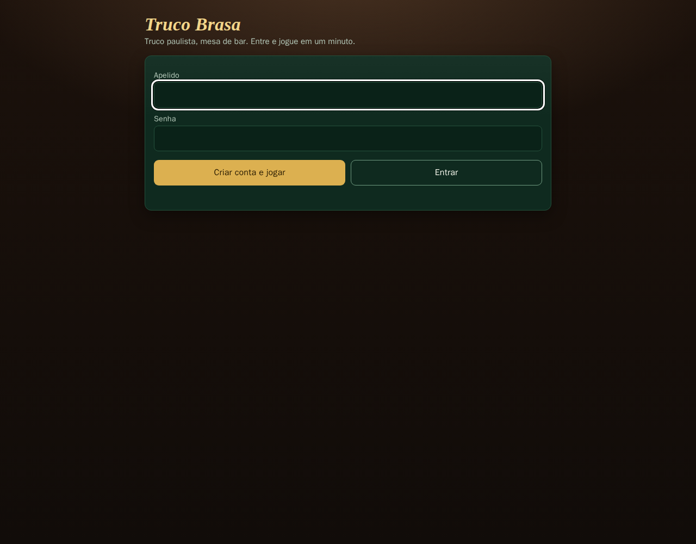

### Saguão: saldo, emblemas, modo e aposta

Todo jogador começa com **1000 moedas** e aposta quanto quiser. Os seis emblemas são
derivados da estatística na leitura, nunca guardados — mudar o critério é mudar uma função,
não reprocessar uma tabela.


### Ranking

Ordenado por vitórias, desempatado por moedas. É público e **não expõe o id interno** de
ninguém — vazamento que eu mesmo encontrei olhando a saída de um `curl`.

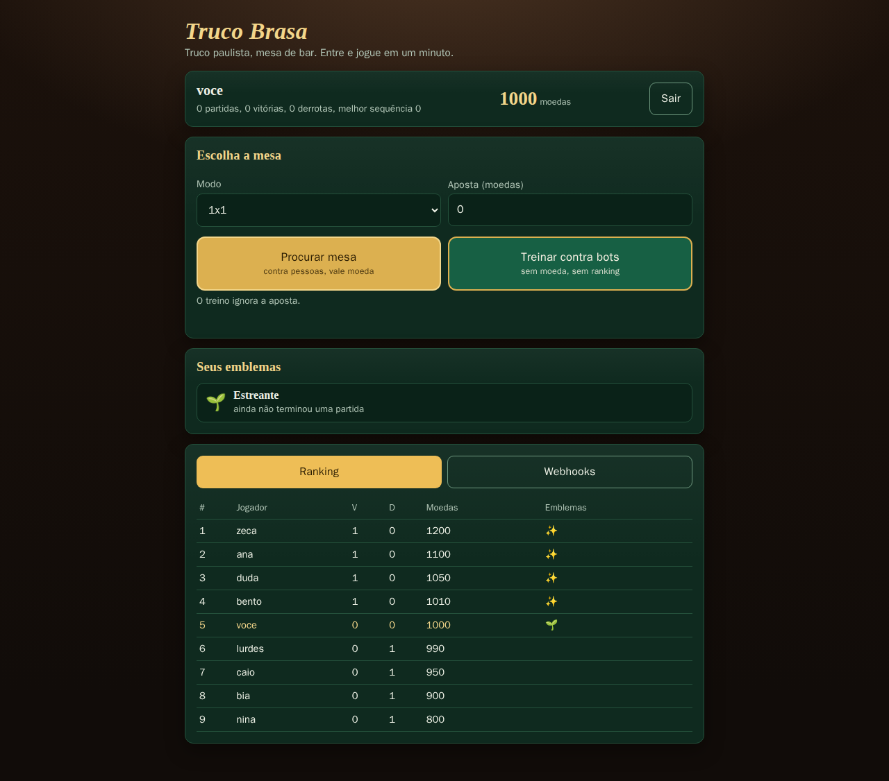

### Webhooks

Um jogador ou integrador registra uma URL e recebe `partida.comecou` e `partida.terminou`,
assinados com **HMAC-SHA256** do corpo exato. O segredo aparece **uma vez só**. O destino
passa por guarda de SSRF: laço, redes privadas, link-local e esquemas que não são `https`
são recusados.

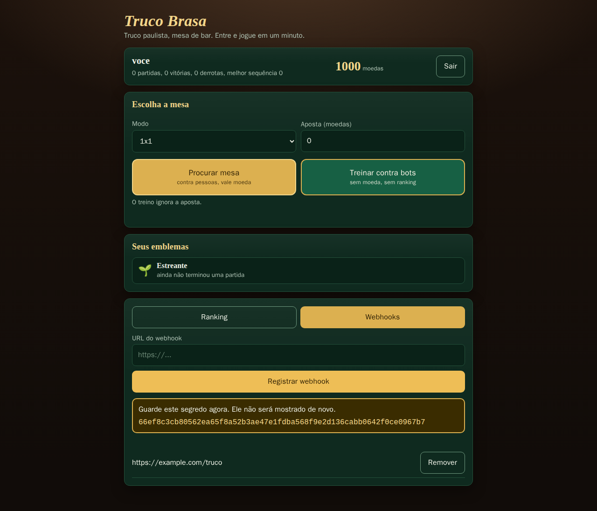

### A mesa, e o truco

Cartas desenhadas a partir do ponto de código — o caractere Unicode continua sendo o dado e
vai em `data-carta` e no `title` de cada carta, então dá para conferir no inspetor. O
dourado é usado só para o que o jogador consulta a cada jogada: de quem é a vez, a manilha,
o valor da mão.

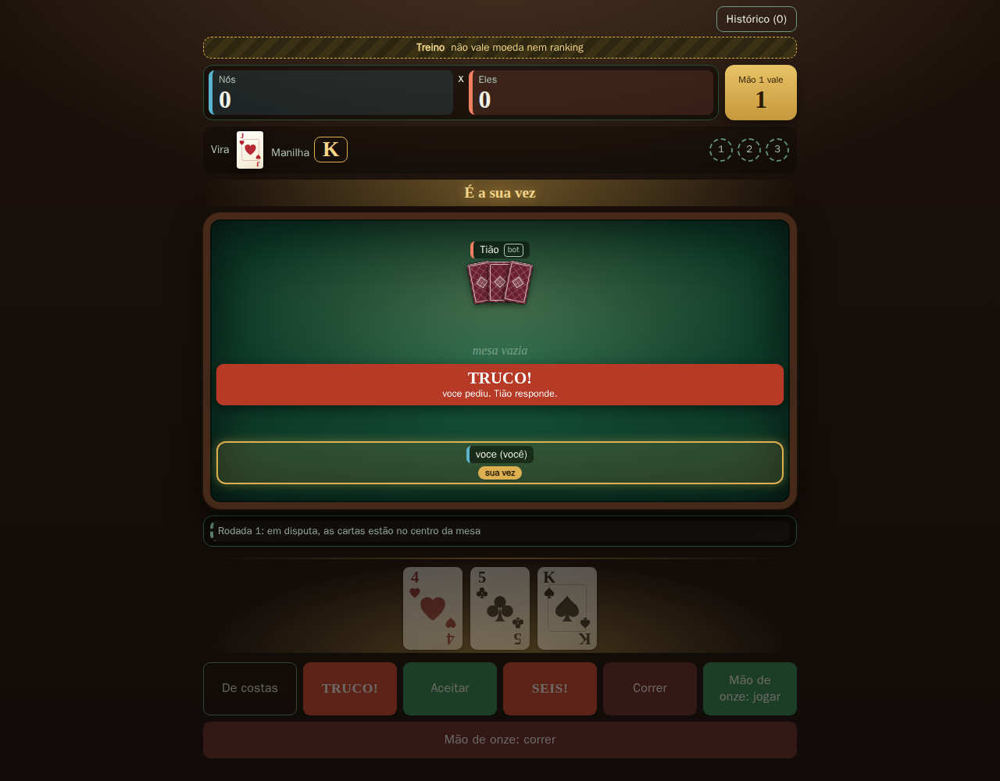

### A rodada resolvida fica em tela

Três faixas — rodada 1, 2 e 3. As decididas mostram as cartas jogadas, quem jogou cada uma,
e a **carta vencedora com anel dourado e o selo "levou"**.

Isto existe porque quem jogou relatou que *"depois que jogo a carta não dá para ver o que o
outro jogou na sequência"*. Era defeito de **protocolo**, não de tela: o estado dizia quem
levou a rodada sem dizer com quais cartas, e nenhum cliente resolveria
([R05](https://github.com/yryapu/poliorketikos-truco-brasa/blob/main/refutacoes/R05-o-protocolo-nao-tinha-o-dado.md)).

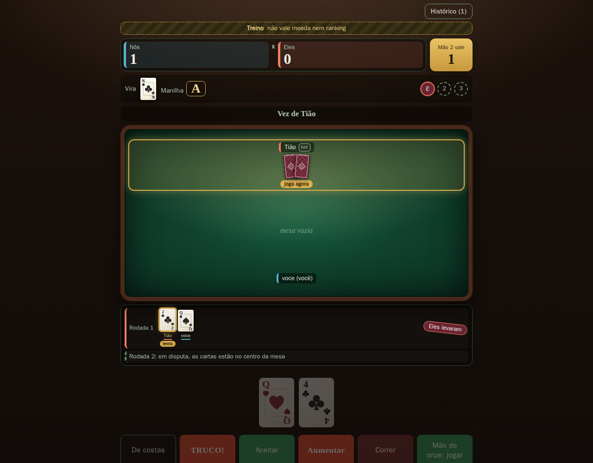

### Histórico de mãos, filtrável

Cada mão: número, vira, manilha, quanto valeu, as rodadas com as cartas e quem levou cada
uma, como terminou, e o placar depois. Filtros por resultado, por "só com truco"
(`valor > 1`) e por jogador.

O histórico é montado no cliente a partir dos avisos, então **recarregar a página o apaga** —
e isso está dito na própria tela, em vez de prometido e não cumprido
([ADR-010](https://github.com/yryapu/poliorketikos-truco-brasa/blob/main/decisoes/ADR-010-historico-no-cliente.md)).

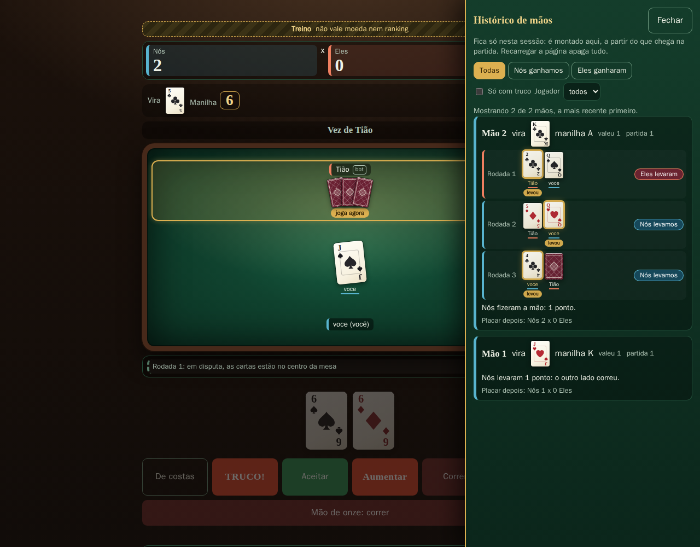

### 2x2 em duplas

Parceiro à frente, adversários nos lados, cada dupla com a sua cor. No treino 2x2 a mesa
enche com três bots — um deles o seu parceiro.

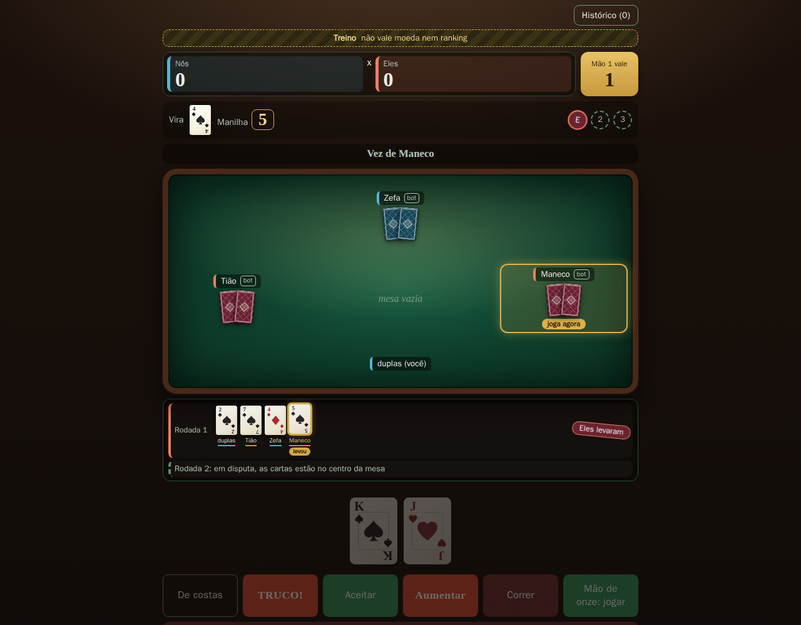

### Fim de partida

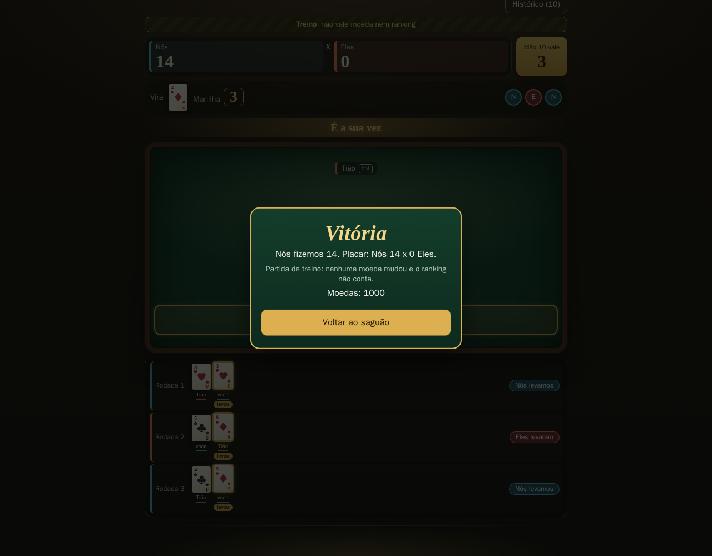

### No celular

380 px sem rolagem horizontal.

<p align="center">
  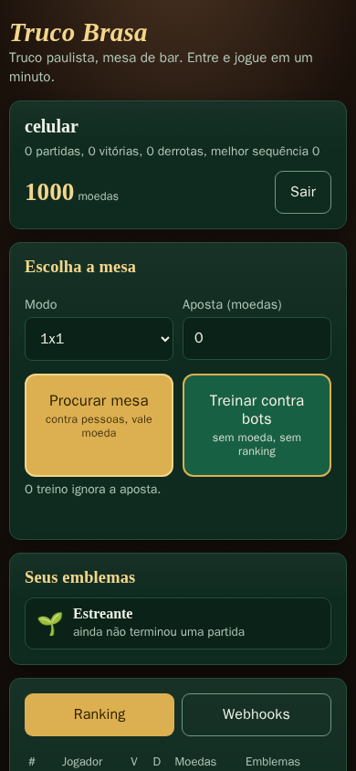
  &nbsp;&nbsp;
  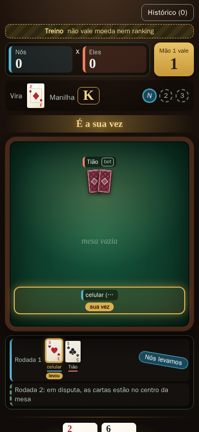
</p>

---

## Os bots

**O bot é um cliente como qualquer outro.** Recebe exatamente a mesma `Visao` que um humano
no mesmo assento e responde com as mesmas cinco mensagens do protocolo. Não há acesso ao
estado da partida, nem canal privilegiado.

Isso não é elegância: é a propriedade que o torna **incapaz** de ver a carta do adversário,
em vez de apenas não programado para ver. Se alguém piorar a estratégia amanhã, continua
impossível trapacear.

**Mesa com bot é treino: não vale moeda, não conta vitória, emblema nem ranking.** Dois
motivos, os dois de integridade — moeda saindo de um bot é inflação (ele não tem saldo de
onde ela saia), e vitória contra bot no ranking seria *implementar* o farm de reputação que
esta mesma entrega declara como risco conhecido. A aposta é **forçada a zero no servidor**,
não apenas escondida na tela ([ADR-009](https://github.com/yryapu/poliorketikos-truco-brasa/blob/main/decisoes/ADR-009-bots-e-treino.md)).

O bot cobre a carta alheia com o mais barato que vence, descarta de costas quando não pode
vencer, puxa com a mais forte, aceita truco com mão que mata e corre com mão fraca. Não é um
bot bom — é um bot honesto e terminante, e é isso que o teste prova.

---

## Como testar

```sh
cargo test --all        # 57 testes, nenhum mock
docker compose -f compose.teste.yaml up --build \
  --abort-on-container-exit --exit-code-from front   # 7 testes de interface
```

O segundo sobe o servidor em container e roda o **Playwright** contra ele, com dois
navegadores independentes na mesma mesa. Em container porque o `node` desta máquina está
quebrado e consertar a instalação de quem avalia é efeito colateral que ninguém pediu
([ADR-008](https://github.com/yryapu/poliorketikos-truco-brasa/blob/main/decisoes/ADR-008-como-testar-o-front.md)).

As fotos deste README saem de:

```sh
docker compose -f compose.teste.yaml --profile capturas run --rm capturas
```

Elas ficam **fora** da suíte de propósito: foto não afirma nada, e um arquivo que não afirma
nada não deve poder reprovar o CI.

### O que os testes provam, e o que não

| | |
|---|---|
| **40 testes de regra** | baralho de 40, ordem de força (inclusive `Q < J`), manilha e a vira `3 → 4`, naipes das manilhas, a tabela de empate caso a caso, carta de costas, a escada `1→3→6→9→12`, mão de onze, mão de ferro, e o 1x1 como dupla de um. Cada um cita a etiqueta da regra. |
| **1 teste de propriedade** | 400 partidas (200 sementes × 2 modos) com todos os assentos jogados pelo bot, exigindo que nenhuma ação escolhida a partir de `acoes` seja recusada pelas regras e que a partida sempre chegue aos 12. **Foi ele que encontrou um defeito de regra que 12 testes de exemplo não encontraram** ([R04](https://github.com/yryapu/poliorketikos-truco-brasa/blob/main/refutacoes/R04-a-vez-seguia-a-cadeia-de-retrucos.md)). |
| **16 testes de integração** | servidor de verdade em porta efêmera, WebSocket de verdade, receptor de webhook de verdade. Partida completa 1x1 e 2x2 com a soma dos saldos conservada; nenhum assento recebe carta de outro; oito abas apostando tudo ao mesmo tempo não deixam o saldo negativo; quem **para** de jogar perde no prazo e o dinheiro do outro não fica preso; o HMAC confere e um segredo errado **não** confere. |
| **7 testes de interface** | dois navegadores se encontram e jogam até 12; o tempo até a primeira carta; o segredo do webhook aparece uma vez; destino proibido é recusado; treino contra bot até o fim sem mover moeda; **a carta do adversário continua visível depois de a rodada fechar**; o histórico guarda cada mão e filtra. |

**O que não está provado** está em [`resultado.json`](resultado.json), em
`riscos_conhecidos` — dez cenários, cada um com o que dispara, o efeito, e **quem paga**.
Comece por eles: a lista de feitos é a parte fácil de escrever.

---

## Desenho

| onde | o que |
|------|-------|
| `crates/regras` | as regras do truco, **puras**: sem rede, sem banco, sem async, sem `tokio`. É essa fronteira que mantém reversível a decisão de não usar WASM ([ADR-003](https://github.com/yryapu/poliorketikos-truco-brasa/blob/main/decisoes/ADR-003-wasm-no-cliente.md)) |
| `crates/servidor` | `axum`: HTTP, WebSocket, sessão, saldo, mesas, ranking, webhooks, bots |
| `cliente/index.html` | o cliente inteiro, **um arquivo, sem build**. Vai embutido no binário por `include_str!`, então `cargo run` e `docker run` servem o mesmo cliente que o teste exercitou |
| `teste-front/` | Playwright: a suíte e as capturas |
| [`PROTOCOLO.md`](PROTOCOLO.md) | o contrato entre cliente e servidor |

**A stack e o porquê de cada peça:** `axum` (WebSocket de primeira classe no mesmo roteador
do HTTP, então o *upgrade* herda o cookie sem ponte), `tokio`, `sqlx` + **SQLite** (ACID para
o saldo, um arquivo, nenhum segundo processo), `argon2id` para senha, cookie opaco com tabela
para sessão (JWT não se revoga), `ChaCha20` do SO para embaralhar, `hmac`+`sha2` para assinar
webhook. Cada escolha com a alternativa descartada em
[ADR-001](https://github.com/yryapu/poliorketikos-truco-brasa/blob/main/decisoes/ADR-001-stack-do-servidor.md)
e [ADR-002](https://github.com/yryapu/poliorketikos-truco-brasa/blob/main/decisoes/ADR-002-sessao-e-cadastro.md).

**WASM no cliente: não.** E o motivo é de segurança, não de preguiça — o servidor tem de ser
autoritativo de todo modo, então WASM não substituiria a execução da regra, a duplicaria; e
para o cliente avaliar quem ganha ele precisaria do modelo de baralho. *O cliente que não
sabe as regras é o cliente que não pode vazar a mão do adversário.*

### O invariante que vale a pena conhecer

A visão de cada assento é montada num só lugar, no crate de regras, com teste. O teste é
escrito como **lista branca**:

> todo caractere de carta na visão do assento `i` está em `{a mão dele} ∪ {a vira} ∪ {as
> cartas abertas, na mesa ou em rodada resolvida}`

e não como lista negra ("não contém carta de outro assento"). A diferença não é estilo: a
lista negra depende de eu ter imaginado todas as formas do proibido, e deixou passar um
indicador de manilha que desenhava uma carta real. A lista branca **avisa quando a superfície
muda** e obriga a decidir se a mudança é intencional.

---

## Variáveis de ambiente

| nome | padrão | o que faz |
|------|--------|-----------|
| `TRUCO_ENDERECO` | `127.0.0.1:8080` | onde escutar |
| `TRUCO_BANCO` | `sqlite://truco.db` | arquivo do SQLite |
| `TRUCO_PORTA` | `8080` | só no `compose.yaml`: a porta publicada no hospedeiro |
| `TRUCO_SEGURO` | desligado | liga `Secure` no cookie e exige `https` no webhook. **Ligue em produção.** |
| `TRUCO_PRAZO_SEGUNDOS` | `60` | quanto a mesa espera por uma jogada antes de encerrar |
| `TRUCO_PAUSA_BOT_MS` | `1100` | quanto o bot "pensa". Sem pausa, a mão resolve entre dois quadros |
| `TRUCO_WEBHOOK_LOCAL` | desligado | deixa o webhook apontar para endereço privado. Só para testar na própria máquina; o servidor **recusa subir** com isto junto de `TRUCO_SEGURO=1` |

---

## Estado

v1 entregue, mais três rodadas de uso. Ver [`resultado.json`](resultado.json): dez critérios
com o comando que prova cada um, dez riscos conhecidos com quem paga, e a seção `apos_a_v1`
com o que foi pedido depois de alguém jogar de verdade — e o que esse uso revelou que 54
testes não tinham revelado.
